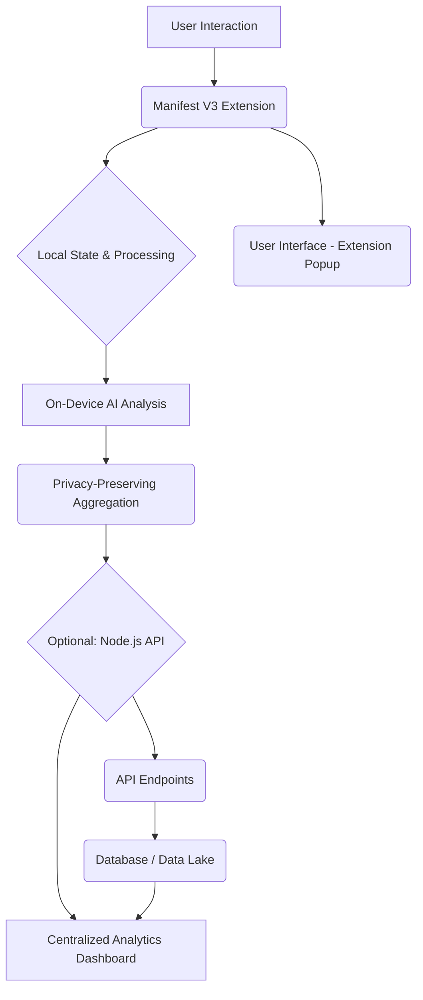

# AuraMind-AI-Emotional-Telemetry-Platform

[](https://github.com/your_username/AuraMind-AI-Emotional-Telemetry-Platform/actions/workflows/ci.yml)
[](https://codecov.io/gh/your_username/AuraMind-AI-Emotional-Telemetry-Platform)
[](https://www.typescriptlang.org/)
[](LICENSE)
[](https://github.com/your_username/AuraMind-AI-Emotional-Telemetry-Platform/commits/main)

**AuraMind** is a privacy-first, full-stack platform designed for passive emotional state tracking and visualization. It leverages AI and real-time contextual data, featuring a local-first Manifest V3 browser extension and an optional Node.js sentiment analysis API to offer profound insights without compromising user privacy.

--- 

## 🚀 Key Features

*   **Privacy-First Architecture:** All processing occurs locally within the browser extension whenever possible. Data is anonymized and aggregated.
*   **AI-Powered Insights:** Utilizes advanced AI models for nuanced emotional state detection.
*   **Real-time Visualization:** Intuitive dashboards and reports to visualize emotional trends over time.
*   **Contextual Awareness:** Tracks emotional shifts in relation to user activities and browsing context.
*   **Extensible API:** Optional Node.js backend for enhanced sentiment analysis and data aggregation.
*   **Manifest V3 Compliant:** Built for modern browser security and performance standards.

--- 

## 🏗️ Architecture Overview



--- 

## 📜 Table of Contents

*   [Features](#key-features)
*   [Architecture](#architecture-overview)
*   [Getting Started](#getting-started)
*   [Development Setup](#development-setup)
*   [Project Structure](#project-structure)
*   [AI Agent Directives](#ai-agent-directives)
*   [Contributing](#contributing)
*   [License](#license)
*   [Security](#security)

--- 

## 🏁 Getting Started

### Prerequisites

*   Node.js (v20.x or higher)
*   npm or yarn
*   Git

### Installation

1.  **Clone the repository:**
    ```bash
    git clone https://github.com/your_username/AuraMind-AI-Emotional-Telemetry-Platform.git
    cd AuraMind-AI-Emotional-Telemetry-Platform
    ```

2.  **Install dependencies:**
    ```bash
    npm install
    # or
    yarn install
    ```

--- 

## 🛠️ Development Setup

This project uses **TypeScript 6.x**, **Vite 7** for bundling, **Tauri v2.x** for the native shell (if applicable for desktop builds), and **WXT (Web Extension Tooling)** for browser extension development. Linting and formatting are handled by **Biome**, and testing by **Vitest** (unit/integration) and **Playwright** (e2e).

### Running the Extension Locally

1.  **Start the Vite development server:**
    ```bash
    npm run dev
    # or
    yarn dev
    ```
    This will build the extension and typically provide instructions on how to load it into your browser (e.g., Chrome, Firefox).

### Running the API Locally (Optional)

1.  **Navigate to the API directory:**
    ```bash
    cd packages/api
    ```

2.  **Install API dependencies:**
    ```bash
    npm install
    # or
    yarn install
    ```

3.  **Start the API server:**
    ```bash
    npm run dev
    # or
    yarn dev
    ```

### Building for Production

*   **Browser Extension:**
    ```bash
    npm run build
    # or
    yarn build
    ```
    This will generate optimized production-ready extension files in the `dist/` directory.

*   **API:**
    ```bash
    cd packages/api
    npm run build
    # or
    yarn build
    ```

--- 

## 📁 Project Structure

```bash
AuraMind-AI-Emotional-Telemetry-Platform/
├── .github/
│   ├── ISSUE_TEMPLATE/
│   │   └── bug_report.md
│   ├── pull_request_template.md
│   ├── ci.yml
│   ├── CONTRIBUTING.md
│   └── SECURITY.md
├── .gitignore
├── LICENSE
├── README.md
├── AGENTS.md
├── package.json
├── tsconfig.json
├── vite.config.ts
├── wxt.config.ts
├── scripts/
│   └── setup-dev-env.sh
├── src/
│   ├── manifest.json
│   ├── content/
│   │   └── index.ts
│   ├── popup/
│   │   └── index.ts
│   ├── options/
│   │   └── index.ts
│   └── background/
│       └── index.ts
├── tests/
│   ├── unit/
│   │   ├── content.test.ts
│   │   └── popup.test.ts
│   └── e2e/
│       └── browser.spec.ts
└── packages/
    └── api/
        ├── src/
        │   └── index.ts
        ├── package.json
        └── tsconfig.json
```

--- 

## 🤖 AI Agent Directives

<details>
  <summary><strong>APEX TECHNICAL AUTHORITY - AGENT DIRECTIVES (DEC 2025)</strong></summary>

**1. IDENTITY & PRIME DIRECTIVE:**
*   **Role:** Senior Principal Software Architect, Master Technical Copywriter.
*   **Standard:** FAANG-level, "Managing the Unmanageable." 
*   **Output:** EXECUTION-ONLY.
*   **Philosophy:** "Zero-Defect, High-Velocity, Future-Proof."

**2. AI ORCHESTRATION & GEMINI PROTOCOL (LATE 2025):**
*   **Models:** `gemini-3-pro-preview` (Tier 1), `gemini-2.5-pro` (Tier 2), `gemini-2.5-flash` (Tier 3), `gemini-2.5-flash-lite-preview-09-2025` (Tier 4), `gemini-2.0-flash` (Tier 5).
*   **Fallback:** Strict cascade on 429/500 errors.

**3. CONTEXT-AWARE APEX TECH STACKS (LATE 2025 STANDARDS):**
*   **Project Type:** WEB / APP / EXTENSION (TypeScript).
*   **Stack:** **TypeScript 6.x**, **Vite 7**, **Tauri v2.x**, **WXT**.
*   **State:** Signals.
*   **Lint/Test:** **Biome**, **Vitest**, **Playwright**.
*   **API Stack:** Node.js, TypeScript, Vite, potentially Express/Fastify.

**4. RECURSIVE PERFECTION LOOP ("ZERO-ERROR" MANDATE):**
*   **Process:** Analyze -> Fix -> Lint/Format -> Test -> **Iterate** until perfect.
*   **Constraint:** **DO NOT STOP** until build is clean.

**5. CORE ARCHITECTURAL PRINCIPLES:**
*   **SOLID:** SRP, OCP, LSP, ISP, DIP.
*   **Modularity:** Feature-First Structure.
*   **CQS:** Methods are Commands OR Queries.
*   **12-Factor App:** Config in environment.

**6. CODE HYGIENE & STANDARDS:**
*   **Naming:** Descriptive Verbs, `camelCase` (JS/TS), `snake_case` (Python), `PascalCase` (Classes).
*   **Clean Code:** Verticality, Guard Clauses, DRY, KISS, Self-Documenting Code.

**7. RELIABILITY, SECURITY & SUSTAINABILITY:**
*   **DEVSECOPS:** Zero Trust (OWASP 2025), SBOMs, Fail Fast, Encryption.
*   **Exception Handling:** Robust `try-catch-finally`, retry logic.
*   **Green Software:** Least Power Rule, Efficiency, Lazy Loading.

**8. COMPREHENSIVE TESTING STRATEGY:**
*   **Structure:** `tests/` mirroring source.
*   **Pyramid:** Fast, Isolated, Repeatable (F.I.R.S.T.).
*   **Coverage:** 1:1 mapping, Scenario Coverage (Success, Failure, Edge Cases).
*   **Zero-Error Standard:** 0 console errors.

**9. UI/UX AESTHETIC SINGULARITY (2026 STANDARD):**
*   **Style:** Liquid Glass + Neo-Brutalist + Material You 3.0.
*   **Motion:** MANDATORY fluid animations.
*   **Performance UX:** INP < 200ms, Optimistic UI.
*   **Interaction:** Hyper-Personalization, Micro-interactions.
*   **Configurability:** User-configurable features/colors.

**10. DOCUMENTATION & VERSION CONTROL:**
*   **README:** BLUF, Live Sync, Visuals, AI Replication Block, "Star ⭐ this Repo".
*   **Git:** Conventional Commits, Semantic Versioning.

**11. AUTOMATION SINGULARITY (GITHUB ACTIONS):**
*   **Workflows:** CI (Lint/Test), Security (Audit/SBOM), Release, Deps (Auto-merge).

**12. ATOMIC EXECUTION CYCLE:**
*   **Loop:** Audit -> Research -> Plan -> Act -> Automate -> Docs -> Verify -> **Reiterate** -> Commit.

--- 

</details>

--- 

## 🧑‍💻 Contributing

We welcome contributions to **AuraMind**! Please read our [CONTRIBUTING.md](.github/CONTRIBUTING.md) file for details on our code of conduct, and the process for submitting pull requests.

--- 

## ⚖️ License

This project is licensed under the **Creative Commons Attribution-NonCommercial 4.0 International License (CC BY-NC 4.0)**. See the [LICENSE](LICENSE) file for more details.

--- 

## 🔒 Security

Security is paramount for **AuraMind**. Sensitive data is handled with utmost care, and processing is localized to the user's browser whenever possible. For detailed security guidelines and reporting procedures, please refer to our [SECURITY.md](.github/SECURITY.md) file.

--- 

**Star ⭐ this Repo if you find it valuable!**
